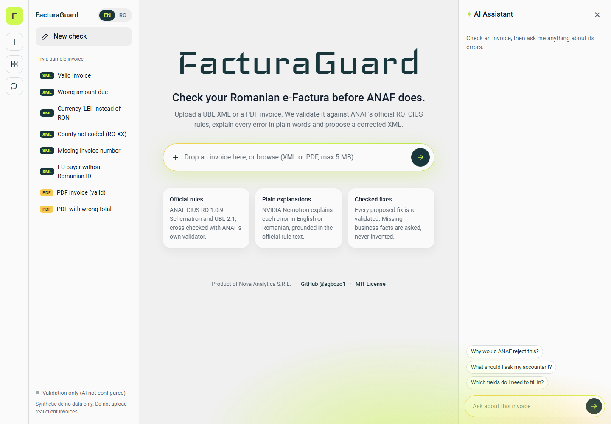
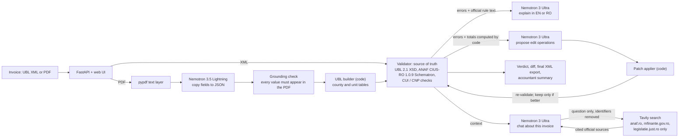

# FacturaGuard

**Check Romanian e-Factura invoices before ANAF rejects them.** FacturaGuard validates a UBL
XML or PDF invoice against ANAF's official rules, explains every error in plain English or
Romanian with NVIDIA Nemotron on Nebius Token Factory, and proposes a corrected XML that is
re-validated before you see it. It complements accountants; it does not replace them.

Built for the Nebius x NVIDIA Global AI Hackathon, track **Best Apps and Agents**.
Synthetic data only.

- **Live demo:** https://facturaguard.onrender.com (free tier: the first visit after a quiet period takes about a minute to wake up). Try https://facturaguard.onrender.com/?sample=payable
- **Demo video:** TODO (YouTube, 3 minutes)
- Hackathon checklist: [docs/HACKATHON.md](docs/HACKATHON.md). Platform feedback: [FEEDBACK.md](FEEDBACK.md).



## What, why, how

**What.** Upload an invoice (UBL XML, or a text PDF). FacturaGuard tells you whether ANAF would
accept it, explains each error in plain words, proposes a corrected XML, answers follow-up
questions, and produces a summary you can send to your accountant.

**Why.** Since 2024 Romanian B2B invoices must go through ANAF's e-Factura system, which rejects
anything that breaks the RO_CIUS profile of EN 16931. The rejection messages are terse rule
codes in technical Romanian. Foreign founders and small businesses depend on their accountant
for every small fix. We also measured why a plain chatbot is not the answer: asked what an
e-Factura needs before ANAF accepts it, Nemotron Ultra and Super both answered wrongly (a
qualified signature, an invented "CIUS-PT" profile), see [FEEDBACK.md](FEEDBACK.md).

**How.** Deterministic code decides; the model explains and proposes.
1. A validator runs UBL 2.1 XSD, ANAF's CIUS-RO 1.0.9 Schematron and ANAF's identifier checks.
   It agrees with ANAF's own offline validator on 100 of 100 test invoices.
2. Nemotron 3 Ultra explains each error, given only the validator message and the official
   rule text (1,105 rules extracted from ANAF's files, Romanian and English).
3. Nemotron proposes small edit operations, never a new document. Code applies them and
   re-validates; edits are kept only if errors go down. Totals are computed by code, and
   missing business facts become questions for the user, never invented values.
4. For PDFs, Nemotron 3.5 Lightning copies fields from the text, code checks each value
   appears in the PDF, and code builds the UBL.

## Architecture



All model calls go through one module, `facturaguard/llm/client.py`, using the OpenAI-compatible
Token Factory API. Code asks for a role (`fast`, `reasoning`, `balanced`); `.env` maps roles to
model IDs, so models can be swapped without code changes.

## How Nebius Token Factory and NVIDIA Nemotron are used

| Role | Model (Token Factory) | Used for | Notes |
|---|---|---|---|
| `reasoning` | `nvidia/Nemotron-3-Ultra-550b-a55b` | Explanations, repair operations, chat | Grounded in validator output and official rule text |
| `fast` | `nvidia/Nemotron-3_5-Lightning` | PDF field extraction | Thinking switched off via `chat_template_kwargs` (verified: 1.3 s instead of a truncated 800-token monologue) |
| `balanced` | `nvidia/nemotron-3-super-120b-a12b` | Configured alternative | Swap in via `.env` |

- **Token Factory** is the only inference provider. Base URL and model IDs are configuration.
- **Where it helped:** one OpenAI-compatible endpoint for every Nemotron size, so the same client
  serves fast extraction and heavy reasoning; JSON responses for structured output; low latency
  on Ultra (0.5 to 0.7 s for short answers in our smoke tests).
- **Other Nebius services:** none yet. The app is hosted on Render (free tier) because it needs a
  persistent web process with a native XSLT engine. The Docker image runs unchanged on a
  Nebius AI Cloud VM.
- Detailed, dated notes (latency, Romanian quality, docs gaps, feature wishes): [FEEDBACK.md](FEEDBACK.md).

## Official sources with Tavily

Optional (`TAVILY_API_KEY`). The same grounding principle, extended to the web:

- **Assistant with citations.** Questions beyond the rule texts (deadlines, penalties, VAT
  treatment) are searched on `anaf.ro`, `mfinante.gov.ro` and `legislatie.just.ro` only.
  Nemotron answers from those pages and cites them as [1], [2], with links under the answer.
  Results from any other site are dropped in code. If the sources do not answer, the assistant
  says so instead of answering from memory. A toggle turns search off per question.
- **Official rules first.** Before any web search, code searches all 1,105 official CIUS-RO and
  EN 16931 rule texts (offline keyword search, `facturaguard/rules/search.py`) and gives the best
  matches to Nemotron, which cites them by rule ID. For example, "how do I show a USD invoice
  with its RON equivalent?" is answered from BR-RO-030 and BR-53.
- **Only cited sources are shown.** Pages the answer does not cite are listed separately under
  "Also searched", so an unused page never looks like support.
- **Citation check.** Prompts alone did not stop every memory leak in our tests, so code
  checks each answer: a sentence that states a rule, number, deadline or legal reference without
  a valid [n] citation is shown under the answer as "not from a cited source, please verify".
- **Ambiguous questions.** If a question can mean different things (an invoice "rejected" by
  the client or by ANAF's validation), the assistant asks before answering.
- **Privacy.** Only the user's question is sent to Tavily, after CIFs, CNPs, IBANs and emails
  are removed. Invoice data is never sent.
- **Rule-update check.** "Check ANAF for updates" searches official pages for a CIUS-RO
  Schematron newer than the 1.0.9 used here. Code (not the model) looks for the
  `ro16931-ubl-x.y.z` package name and shows a warning if a newer one is mentioned. Results are
  cached for 12 hours. It never changes validation.

Code: `facturaguard/search/`. Without a key both features are hidden.

## Results so far

| Check | Result |
|---|---|
| Our verdict vs ANAF's offline validator (ROeFacturaValidator 1.3.0), 100 synthetic invoices | **100 / 100 same verdict**, every ANAF finding also reported by us |
| Planted errors detected (27 error types, 66 invalid invoices) | 100% of expected rules fire |
| PDF to UBL rebuild with correct fields (52 PDFs) | 50 byte-identical to the original XML; 2 differ only where paper cannot distinguish BT-106 from BT-109 |
| Automated tests | 110 passing (fake model; no key needed) |
| Docker image under a 512 MB memory cap | 100 / 100 invoices validated, about 200 MB used |
| **Repair with Nemotron 3 Ultra** (28 invoices, one per error type) | **18 fixed** and re-validated as valid; **8 correctly asked** the user for a missing fact instead of inventing it; 1 asked for the invoice type code where we expected a fix (arguably right: 380, 384 and 389 mean different things); 1 truncated file declined by design. Median 2.7 s per call |
| **PDF extraction with Nemotron 3.5 Lightning** (52 PDFs) | **97.2% of fields correct** (2,377 of 2,446); **51 of 52** PDFs get the same validator verdict as the original invoice. Median 2.8 s per PDF |
| Hosted app, real calls (Render to Token Factory) | Explain 4.5 s, repair 2.5 s, fix re-validated as valid |

Eval details: `docs/eval/` (raw per-invoice results; reproduce with `scripts/eval_repair.py`
and `scripts/eval_extraction.py`). The first extraction run scored 89.7%: most misses were
Lightning returning Romanian number formats ("2.054,66") despite instructions, and full address
lines in the street field. We fixed this in deterministic code (number parsing, address
splitting, a quantity x price check) rather than trusting the model to convert, and the
grounding check now flags a county inferred from the city name rather than printed.

Building the validator surfaced two things worth knowing: the standard ISO Schematron compiler
silently skips rules on XML attributes (ANAF's validator does not, so we patch the compiled
XSLT), and ANAF checks seller and buyer identifiers outside the Schematron. We reproduced the
latter by probing ANAF's tool; see `facturaguard/validation/identifiers.py`.

## Quick start

Requires Python 3.11 to 3.13 (3.12 recommended).

```bash
python3 -m venv .venv && . .venv/bin/activate      # Windows: .venv\Scripts\activate
pip install -e ".[dev,schematron]"
cp .env.example .env                                # add NEBIUS_API_KEY
pytest
uvicorn facturaguard.api.app:app --reload           # open http://127.0.0.1:8000
```

- Click a sample in the sidebar, or open `/?sample=payable` directly.
- Without `NEBIUS_API_KEY` the app still validates and shows official rule texts; AI buttons are
  hidden and PDF upload is unavailable.
- `saxonche` (the XSLT 2.0 engine) has no wheel for Python 3.14 on Intel Macs older than
  macOS 11, nor for musl/Alpine, Windows on ARM or 32-bit Python. Use Python 3.12 or Docker.

Command-line tools (real model calls):

```bash
python scripts/smoke_nebius.py --list                              # model IDs your key can use
python scripts/try_assist.py data/synthetic/xml/SYN-037.xml --lang ro
python scripts/try_pdf.py data/synthetic/pdf/SYN-037.pdf --assist
python scripts/eval_repair.py --limit 28 --out eval_repair.json
python scripts/eval_extraction.py --out eval_extraction.json
```

## Docker and deployment

```bash
docker build -t facturaguard .
docker run -p 8000:8000 --env-file .env facturaguard
```

**Render (free tier):** in the Render dashboard choose New, then Blueprint, pick this repository,
and paste `NEBIUS_API_KEY` when prompted. `render.yaml` defines one Docker web service in
Frankfurt with a health check on `/api/health`. Auto-deploy is off to save build minutes:
after pushing, use **Manual Deploy > Deploy latest commit**. Free instances sleep when idle, so the first
request after a pause takes longer. The key never goes into git.

## Using the app

- **Explain with AI:** plain-language explanation per error, with the official rule text beside it.
- **Propose a fix:** a diff of the changes and the corrected XML to download. If a fix needs a
  business fact (for example the invoice number), the app asks, and uses your answer exactly.
- **Share with accountant:** a summary built by code from the validator results, explanations
  and fix. Copy it, download it as Markdown, or print it to PDF.
- **Export final XML:** downloads the corrected XML if a fix was applied, otherwise the
  original (for a PDF, the XML built from it), and says whether it passes. FacturaGuard does
  not send invoices to ANAF; you send the exported file through your usual channel.
- **About page** (`/about.html`): a plain-language overview with a five-step diagram
  (upload, check, understand, fix, share), in English and Romanian.
- **Assistant:** chat about the current invoice, grounded in its validation results.
- English and Romanian throughout.

## Trust, data and security

- **The validator is the only judge of validity.** The model never declares an invoice valid.
- **Grounding:** explanations get the official rule text; the model is told not to rely on
  memory of tax law. Extracted PDF values are checked against the PDF text.
- **No invented facts:** missing numbers, names and identifiers become questions.
- **Data:** synthetic data only in this repository. Uploaded files live in memory for one hour
  and are never written to disk.
- **Security:** uploads capped at 5 MB; XML with DOCTYPE or ENTITY declarations is refused
  (XXE and entity-expansion attacks); AI calls are rate-limited per client; the container runs
  as a non-root user.

## Limitations

- Text PDFs only. Scanned PDFs need a vision model, and no Nemotron vision model was available
  on our Token Factory key.
- Invoices with standard-rated VAT lines (category S). Exempt, reverse-charge and zero-rated
  categories, allowances and charges are validated but not generated or rebuilt from PDFs.
- Credit notes are validated but not generated from PDFs.
- Rules: ANAF CIUS-RO 1.0.9, still current in ANAF's December 2024 validator. Rules change;
  `vendor/SOURCES.md` records versions and hashes, and `scripts/compare_with_anaf.py` repeats
  the cross-check.
- Open question for an accountant: how an EU business buyer without a Romanian identifier
  should be encoded. ANAF's validator rejects a foreign VAT id alone.

## Project layout

```
facturaguard/
  validation/   XSD, Schematron (saxonche), ANAF identifier checks
  rules/        official rule texts for grounding
  llm/          Token Factory client, prompts, JSON helpers
  explain.py    plain-language explanations
  repair/       edit operations, computed totals, repair loop
  extraction/   PDF text, Nemotron extraction, grounding, UBL builder
  ubl/          UBL renderer, county and unit code tables
  synthetic/    labelled invoice and PDF generator
 api/          FastAPI app and sessions
  chat.py, summary.py
web/            HTML, CSS, JS (no build step)
vendor/         ANAF Schematron, UBL 2.1 XSD, compiled XSLT (see vendor/SOURCES.md)
data/synthetic/ 100 labelled XML invoices, 52 PDFs
scripts/        smoke test, try and eval scripts, Schematron build, ANAF comparison
tests/          pytest suite
```

## License and credits

Copyright (C) 2026 Ebenezer Agbozo (Nova Analytica S.R.L.), GitHub
[@agbozo1](https://github.com/agbozo1).

Licensed under the [GNU Affero General Public License v3.0 only](LICENSE) (AGPL-3.0-only), an
OSI-approved open source licence. You may use, study, modify and share FacturaGuard. If you run
a modified version as a network service, the AGPL requires you to offer its users your
modified source code.

**Commercial licences** are available from Nova Analytica S.R.L. for organisations that want to
use FacturaGuard without the AGPL's obligations. Outside contributions are accepted under a
contributor licence agreement. See [NOTICE](NOTICE).

Vendored rule files keep their own licences: ANAF CIUS-RO Schematron and EN 16931 artefacts
(EUPL 1.2), OASIS UBL 2.1 schemas, ISO Schematron XSLT (MIT). Details in `vendor/SOURCES.md`.
